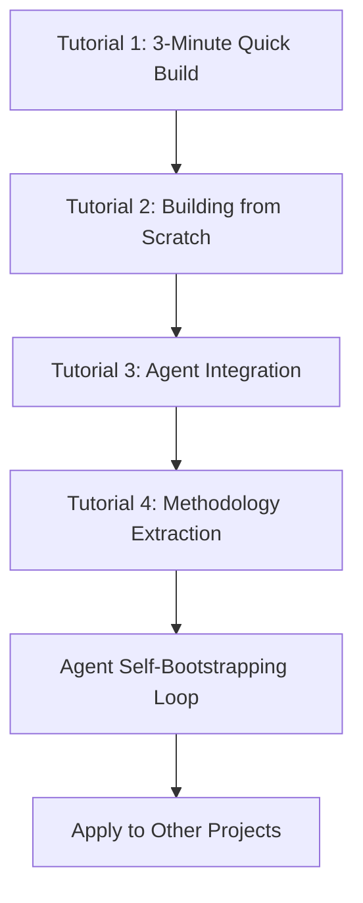
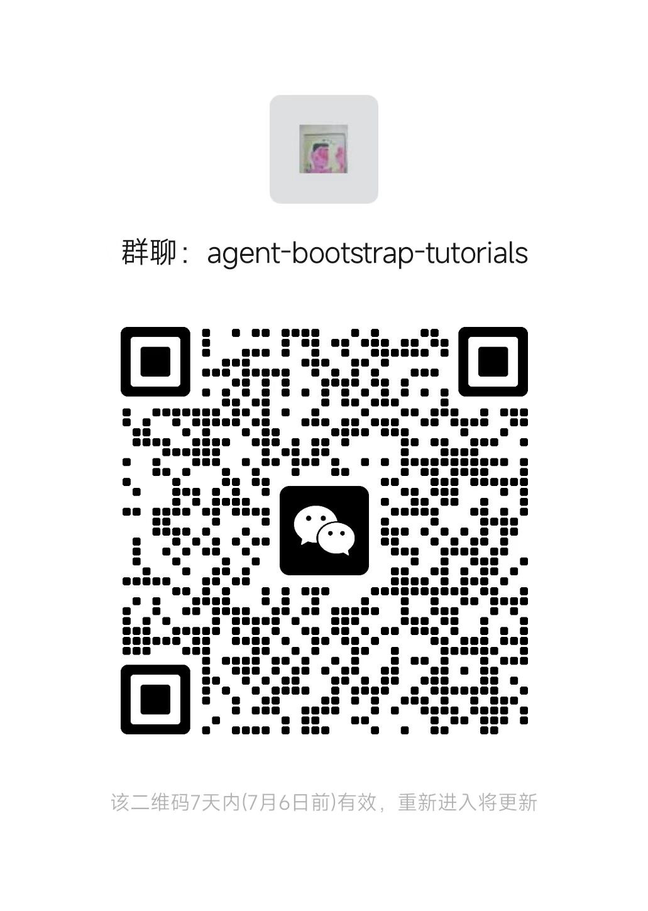

# Agent Bootstrap Tutorials

> Complete tutorials for rapid project startup using Agent collaboration - A minimal Bootstrap methodology from idea to product

## 🌍 Language / 语言

**🇺🇸 English** (Current) | **[🇨🇳 中文](README_CN.md)**

---

## 🎯 Tutorial Overview

This is a comprehensive set of hands-on tutorials for Agent-powered rapid project startup, teaching you to master the essence of Agent collaborative development through real project construction. Compatible with Claude Code Agent tools.

**Core Highlights**:
- 🔄 **Complete Loop**: Full workflow from zero construction to Agent self-bootstrapping
- 📈 **Progressive Learning**: 4 interconnected tutorials with validation at each step
- 🤖 **Agent Self-Bootstrapping**: Integrate built tools back into Agent for workflow automation
- ⚡ **Learn & Apply**: Each tutorial delivers immediately verifiable results

## 🚀 Quick Start

### Tutorial Series Overview

| Tutorial | Topic | Duration | Outcome |
|----------|-------|----------|---------|
| [Tutorial 1](Tutorial-1-3-Minute-Quick-Build.md) | 3-Minute CLI Tool Build | 3 mins | Fully functional command-line tool |
| [Tutorial 2](Tutorial-2-Building-Writing-System-From-Scratch.md) | Building Writing Practice System from Zero | 20 mins | Complete 0-to-1 construction experience |
| [Tutorial 3](Tutorial-3-Agent-Tool-Integration.md) | Agent Tool Integration | 10 mins | Perfect Agent-tool collaboration |
| [Tutorial 4](Tutorial-4-Methodology-Summary-Extension.md) | Methodology Summary & Extension | 5 mins | Reusable Bootstrap methodology |

**Total Duration**: ~40 minutes  
**Total Outcome**: Complete project system + Agent self-bootstrapping workflow + Reusable rapid startup methodology

### Learning Path



## 🎊 Final Results Showcase

After completing all tutorials, you will have:

### 📁 Complete Project Structure
```
project-directory/
├── 01-materials/           # Idea and inspiration collection
│   ├── thought-fragments/
│   ├── daily-observations/
│   └── inspiration-collection/
├── 02-practice-records/    # Structured recording system
│   └── YYYY-MM/           # Monthly organization
├── 03-output-results/     # Complete works archive
├── writing_cli.py         # CLI automation tool
├── w                      # Quick launch script
└── CLAUDE.md             # Agent project memory
```

### ⚡ Smart CLI Tool
```bash
# Basic practice commands
./w init                # Initialize environment
./w practice            # Start today's practice
./w status              # Check practice status
./w random              # Get random prompts

# Material management commands
./w fragment "thought content" --tag "tag"     # Add thought fragment
./w note "quick idea"                          # Quick note
./w search "keyword"                           # Search content

# Output creation commands
./w create "article title"                     # Create new work
./w export "keyword" "title"                   # Export materials to work
```

### 🤖 Agent Self-Bootstrapping Workflow
- **Auto Recording**: All thoughts, planning, documentation automatically saved and archived
- **Smart Invocation**: Agent skillfully uses tools you've built
- **Workflow Loop**: Complete cycle of dialogue→recording→practice→summary
- **Knowledge Accumulation**: Each use adds value to the system

### 🧠 Reusable Methodology
- Best practices for Agent collaborative development
- Decision framework for technology choices
- Rapid project startup templates
- Minimal Bootstrap principles

## 🎯 Target Audience

### ✅ If you are...
- **Programming Beginner**: Want to experience the power of Agent collaborative development
- **Experienced Developer**: Hope to improve project startup efficiency
- **Product Manager**: Need to quickly validate ideas and prototypes
- **Creative Worker**: Want to systematically manage ideas and creative processes
- **Efficiency Optimizer**: Pursue workflow automation

### ✅ You will learn...
- Techniques for natural collaboration with CLI Agents
- Framework for quickly choosing appropriate technical solutions
- Complete implementation process from idea to product
- Methods for building Agent self-bootstrapping workflows
- How to seamlessly integrate tools into daily work

## 🔑 Claude Code Access Required

To follow these tutorials, you'll need access to **Claude Code**. 

### How to Get Claude Code Access
- **Official Access**: Visit [Claude Code Documentation](https://docs.anthropic.com/claude/docs) for official access methods
- **Community Support**: Join our community group for Claude Code access guidance and exclusive benefits! 

### 🎁 Join Our Community for Exclusive Benefits
Having trouble getting Claude Code access? Join our community group where we provide:
- 📋 **Step-by-step access guidance** 
- 🎯 **Claude Code account sharing opportunities**
- 💡 **Exclusive tips and best practices**
- 🤝 **Direct support from experienced users**
- 🎉 **Special community benefits and resources**



*Scan to join our community and get help with Claude Code access!*

---

## 🚀 Get Started Now

### Method 1: Complete Learning (Recommended)
Start from Tutorial 1 to experience the full Bootstrap process:
- [Start Tutorial 1: 3-Minute Quick Build](Tutorial-1-3-Minute-Quick-Build.md)

### Method 2: Systematic Learning
If you're more interested in the complete 0-to-1 construction experience:
- [Go directly to Tutorial 2: Building Writing Practice System from Scratch](Tutorial-2-Building-Writing-System-From-Scratch.md)
- ⚠️ Suggestion: Experience the impressive effect of Tutorial 1 first

### Method 3: Methodology Learning
If you're focused on the methodology itself:
- [Jump to Tutorial 4: Summary and Extension](Tutorial-4-Methodology-Summary-Extension.md)

## 💡 Core Philosophy

### The Essence of Agent Collaborative Development
Not about having AI replace your programming, but making Agent your best project startup assistant:
- **Natural Expression**: Describe needs in plain language, let Agent infer technical details
- **Progressive Clarification**: Gradually clarify and refine ideas through dialogue
- **Rapid Validation**: Small steps, quick iterations, timely direction adjustments

### The Power of Agent Self-Bootstrapping
The ultimate goal is creating a self-reinforcing workflow:
- **Tools Creating Tools**: Agent-built tools are reused by Agent
- **Knowledge Self-Loop**: Each use accumulates more knowledge for the system
- **Workflow Automation**: Thinking, planning, documentation all automatically saved and archived
- **Continuous Optimization**: Continuously optimize tools and processes based on usage data

## 🤝 Community & Contribution

### 💬 Join Our Community Group
🎁 **Special Benefits for Community Members:**
- **Claude Code Access Support**: Get help accessing Claude Code accounts
- **Account Sharing Opportunities**: Community members share Claude Code access
- **Priority Q&A Support**: Faster responses to your questions
- **Exclusive Resources**: Advanced tutorials and tips not available elsewhere
- **Networking**: Connect with other Agent development enthusiasts


*Join our community for Claude Code access help and exclusive benefits!*

### Ways to Participate
- 🌟 **Star**: If the tutorials help you
- 🐛 **Issue**: Found problems or have improvement suggestions
- 💬 **Discussion**: Share your usage experience
- 🔀 **Fork**: Create your projects based on this methodology

### Share Your Results
After completing the tutorials, welcome to share:
- Tools and projects you've built
- Improvements and extensions to the methodology
- Application cases in other domains
- Innovative practices in Agent self-bootstrapping

## 🔗 Related Resources

### Technical Documentation
- [Claude Code Official Documentation](https://docs.anthropic.com/claude/docs)

## 📝 Version History

- **v1.0.0** (2025-06-28): Initial release
  - Complete 4-part tutorial series
  - Real 3-minute build recording
  - Agent self-bootstrapping workflow implementation
  - Reusable methodology framework

## 📄 License

This tutorial is released under [MIT License](LICENSE).

---

## 🎉 Start Your Agent Bootstrap Journey!

Ready to experience the complete loop from idea to product?

**[👉 Click to Start Tutorial 1](Tutorial-1-3-Minute-Quick-Build.md)**

---

*⭐ If this tutorial helps you, please give us a Star!*

*📢 Welcome to share with more friends who need rapid project startup!*