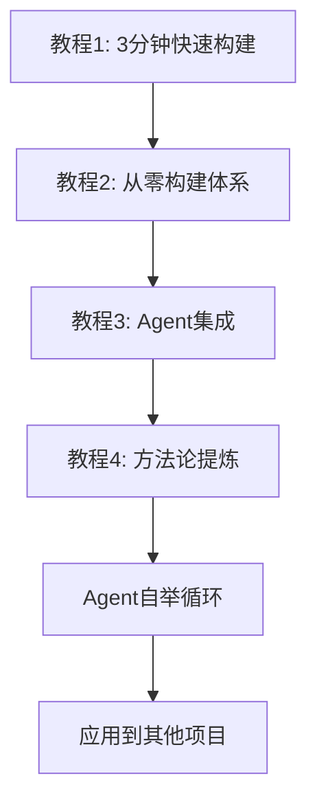

# Agent Bootstrap Tutorials

> 用Agent快速启动项目的完整教程 - 从想法到产品的最小化Bootstrap方法论

## 🎯 教程简介

这是一套完整的Agent项目快速启动实战教程，通过真实的项目构建过程，教你掌握Agent协作开发的精髓。适配Claude Code Agent工具。

**核心亮点**：
- 🔄 **完整闭环**：从零构建到Agent自举的完整流程
- 📈 **循序渐进**：4个教程环环相扣，每步都有验证
- 🤖 **Agent自举**：将构建的工具集成回Agent，实现工作流自动化
- ⚡ **即学即用**：每个教程都有立即可验证的成果

## 🚀 快速开始

### 教程系列概览

| 教程 | 主题 | 用时 | 成果 |
|------|------|------|------|
| [教程1](教程1-3分钟快速构建.md) | 3分钟快速构建CLI工具 | 3分钟 | 功能完整的命令行工具 |
| [教程2](教程2-从零构建写作练习体系.md) | 从零构建写作练习体系 | 20分钟 | 完整的从0到1构建体验 |
| [教程3](教程3-工具集成.md) | Agent工具集成 | 10分钟 | Agent与工具完美协作 |
| [教程4](教程4-总结和扩展.md) | 方法论总结与扩展 | 5分钟 | 可复用的Bootstrap方法论 |

**总用时**：约40分钟  
**总成果**：完整的项目系统 + Agent自举工作流 + 可复用的快速启动方法论

### 学习路径



## 🎊 最终成果展示

完成全部教程后，你将拥有：

### 📁 完整的项目结构
```
项目目录/
├── 01-素材库/          # 想法和灵感收集
│   ├── 思维碎片/
│   ├── 日常观察/
│   └── 灵感收集/
├── 02-练习记录/         # 结构化记录系统
│   └── YYYY-MM/        # 按月组织
├── 03-成果输出/         # 完整作品归档
├── writing_cli.py       # CLI自动化工具
├── w                   # 快捷启动脚本
└── CLAUDE.md           # Agent项目记忆
```

### ⚡ 智能CLI工具
```bash
# 核心命令
./w init                # 初始化环境
./w practice            # 开始工作流程
./w status              # 查看进度统计  
./w note "想法内容"      # 快速记录想法
./w random              # 获取随机提示
```

### 🤖 Agent自举工作流
- **自动记录**：所有思考、规划、文档自动保存归档
- **智能调用**：Agent可熟练使用你构建的工具
- **工作流闭环**：对话→记录→实践→总结的完整循环
- **知识积累**：每次使用都在为系统增加价值

### 🧠 可复用的方法论
- Agent协作开发的最佳实践
- 技术选择的决策框架
- 项目快速启动模板
- 最小化Bootstrap原则

## 🎯 适合人群

### ✅ 如果你是...
- **编程初学者**：想体验Agent协作开发的威力
- **有经验开发者**：希望提升项目启动效率
- **产品经理**：需要快速验证想法和原型
- **创意工作者**：想要系统化管理想法和创作过程
- **效率优化者**：追求工作流程的自动化

### ✅ 你将学会...
- 与CLI Agent自然协作的技巧
- 快速选择合适技术方案的框架
- 从想法到产品的完整实现流程
- 构建Agent自举工作流的方法
- 将工具无缝集成到日常工作中

## 🚀 立即开始

### 方式1：完整学习（推荐）
从教程1开始，体验完整的Bootstrap过程：
- [开始教程1：3分钟快速构建](教程1-3分钟快速构建.md)

### 方式2：理论学习
如果你更关注设计思维和协作方法：
- [直接看教程2：深入理解体系设计](教程2-深入理解体系设计.md)
- ⚠️ 建议：先体验教程1的震撼效果

### 方式3：方法论学习
如果你关注方法论本身：
- [跳转教程4：总结和扩展](教程4-总结和扩展.md)

## 💡 核心理念

### Agent协作开发的本质
不是让AI替代你编程，而是让Agent成为你最好的项目启动助手：
- **自然表达**：用人话说需求，让Agent推断技术细节
- **渐进澄清**：在对话中逐步明确和完善想法
- **快速验证**：小步快跑，及时调整方向

### Agent自举的威力
最终目标是创建一个能够自我强化的工作流：
- **工具生产工具**：用Agent构建的工具再次被Agent使用
- **知识自循环**：每次使用都在为系统积累更多知识
- **工作流自动化**：思考、规划、文档撰写全部自动保存归档
- **持续优化**：基于使用数据不断优化工具和流程

## 🤝 社区与贡献

### 参与方式
- 🌟 **Star**：如果教程对你有帮助
- 🐛 **Issue**：发现问题或有改进建议
- 💬 **Discussion**：分享你的使用体验
- 🔀 **Fork**：基于这套方法创建你的项目

### 分享你的成果
完成教程后，欢迎分享：
- 你构建的工具和项目
- 对方法论的改进和扩展
- 在其他领域的应用案例
- Agent自举的创新实践

## 🔗 相关资源

### 技术文档
- [Claude Code官方文档](https://docs.anthropic.com/claude/docs)


## 📝 版本历史

- **v1.0.0** (2025-06-28): 初始版本发布
  - 完整的4部分教程系列
  - 真实3分钟构建记录
  - Agent自举工作流实现
  - 可复用的方法论框架

## 📄 许可证

本教程采用 [MIT License](LICENSE) 开源协议。

---

## 🎉 开始你的Agent Bootstrap之旅！

准备好体验从想法到产品的完整闭环了吗？

**[👉 点击开始教程1](教程1-从零构建写作练习体系.md)**

---

*⭐ 如果这个教程对你有帮助，请给我们一个Star！*

*📢 欢迎分享给更多需要快速启动项目的朋友！*