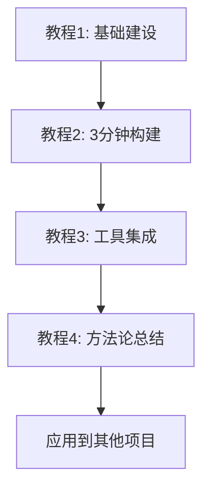

# Claude Code 快速启动项目完整教程

> 从想法到产品，用agent协作开发实现3分钟构建奇迹

## 🎯 教程简介

这是一套完整的Claude Code项目快速启动实战教程，通过真实的项目构建过程，教你掌握agent协作开发的精髓。

**核心亮点**：
- 📊 **真实记录**：基于实际3分钟构建日志
- 🎯 **完整闭环**：从零到完整可用工具
- 🧠 **ADHD友好**：专为注意力分散特质设计
- ⚡ **即学即用**：每个教程都有立即可验证的成果

## 🚀 快速开始

### 教程系列概览

| 教程 | 主题 | 用时 | 成果 |
|------|------|------|------|
| [教程1](教程1-从零构建写作练习体系.md) | 从零构建写作练习体系 | 20分钟 | 完整的项目基础架构 |
| [教程2](教程2-3分钟构建CLI工具.md) | 3分钟构建CLI工具 | 3分钟 | 功能完整的命令行工具 |
| [教程3](教程3-工具集成.md) | 工具集成 | 10分钟 | agent与工具完美协作 |
| [教程4](教程4-总结和扩展.md) | 总结和扩展 | 5分钟 | 可复用的方法论 |

**总用时**：约40分钟  
**总成果**：完整的写作练习系统 + 可复用的快速启动方法论

### 学习路径



## 🎊 最终成果展示

完成全部教程后，你将拥有：

### 📁 完整的项目结构
```
写作练习项目/
├── 01-素材库/          # 想法和灵感收集
│   ├── 思维碎片/
│   ├── 日常观察/
│   └── 灵感收集/
├── 02-练习记录/         # 结构化练习记录
│   └── YYYY-MM/        # 按月组织
├── 03-成果输出/         # 完整作品
├── writing_cli.py       # CLI自动化工具
├── w                   # 快捷启动脚本
└── CLAUDE.md           # 项目记忆配置
```

### ⚡ 强大的CLI工具
```bash
# 核心命令
./w init                # 初始化环境
./w practice            # 开始今日练习
./w status              # 查看进度统计
./w note "想法内容"      # 快速记录灵感
./w random              # 获取随机练习提示
```

### 🧠 可复用的方法论
- agent协作开发的最佳实践
- 技术选择的决策框架
- 项目快速启动模板
- ADHD友好的设计原则

## 🎯 适合人群

### ✅ 如果你是...
- **编程初学者**：想体验agent协作开发的威力
- **有经验开发者**：希望提升项目启动效率
- **ADHD/ASD特质者**：需要友好的工具和流程设计
- **创意工作者**：想要系统化管理想法和创作过程

### ✅ 你将学会...
- 与Claude Code自然协作的技巧
- 快速选择合适技术方案的框架
- 从想法到产品的完整实现流程
- 构建可持续使用工具的方法

## 🚀 立即开始

### 方式1：顺序学习（推荐）
从教程1开始，按顺序完成全部教程：
- [开始教程1：从零构建写作练习体系](教程1-从零构建写作练习体系.md)

### 方式2：快速体验
如果你只想体验3分钟构建的震撼：
- [直接看教程2：3分钟构建CLI工具](教程2-3分钟构建CLI工具.md)
- ⚠️ 注意：需要先有基础项目结构

### 方式3：方法论学习
如果你关注方法论本身：
- [跳转教程4：总结和扩展](教程4-总结和扩展.md)

## 💡 核心理念

### agent协作开发的本质
不是让AI替代你编程，而是让AI成为你最好的项目启动助手：
- **自然表达**：用人话说需求，让AI推断技术细节
- **渐进澄清**：在对话中逐步明确和完善想法
- **快速验证**：小步快跑，及时调整方向

### ADHD友好设计原则
- **微会话**：每次专注5-15分钟，符合注意力特点
- **低摩擦**：减少决策疲劳，提供明确指引
- **即时反馈**：看得见的进步，保持动力
- **结构化**：模板和流程化，降低启动门槛

## 🤝 社区与贡献

### 参与方式
- 🌟 **Star**：如果教程对你有帮助
- 🐛 **Issue**：发现问题或有改进建议
- 💬 **Discussion**：分享你的使用体验
- 🔀 **Fork**：基于这套方法创建你的项目

### 分享你的成果
完成教程后，欢迎分享：
- 你构建的工具和项目
- 对方法论的改进和扩展
- 在其他领域的应用案例

## 📊 成功案例

### 用户反馈
> "3分钟真的构建出了完整的CLI工具，震撼！" 

> "ADHD友好的设计让我第一次坚持完成了一个完整项目"

> "学会了这套方法，我已经用它启动了5个不同的项目"

### 扩展应用
基于这套方法，用户已经成功构建：
- 个人时间管理工具
- 学习笔记整理系统
- 健康数据追踪应用
- 创意项目管理平台

## 🔗 相关资源

### 技术文档
- [Claude Code官方文档](https://docs.anthropic.com/claude/docs)
- [Python命令行开发指南](https://docs.python.org/3/library/argparse.html)

### 设计理念
- [ADHD友好的产品设计](https://example.com)
- [微会话设计模式](https://example.com)

## 📝 版本历史

- **v1.0.0** (2025-06-28): 初始版本发布
  - 完整的4部分教程系列
  - 真实3分钟构建记录
  - 可复用的方法论框架

## 📄 许可证

本教程采用 [MIT License](LICENSE) 开源协议。

---

## 🎉 开始你的快速启动之旅！

准备好体验从想法到产品的3分钟奇迹了吗？

**[👉 点击开始教程1](教程1-从零构建写作练习体系.md)**

---

*⭐ 如果这个教程对你有帮助，请给我们一个Star！*

*📢 欢迎分享给更多需要快速启动项目的朋友！*